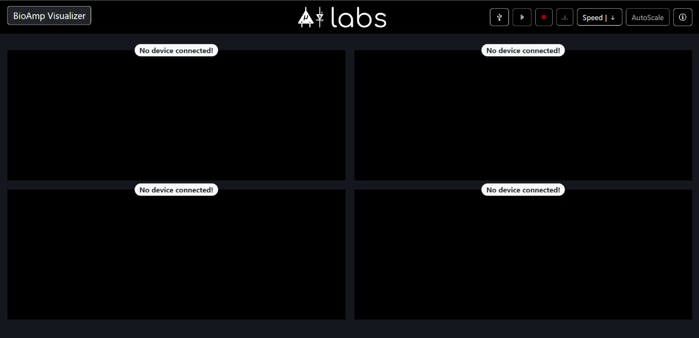
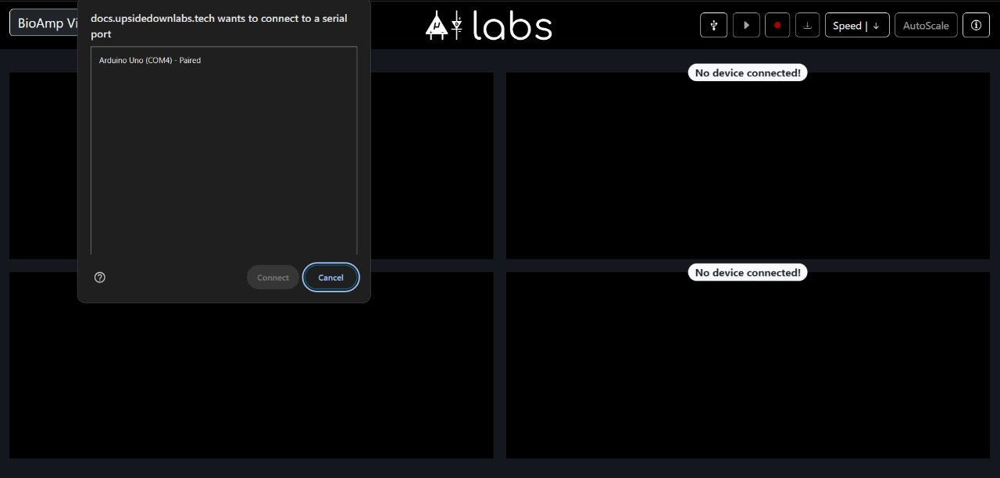
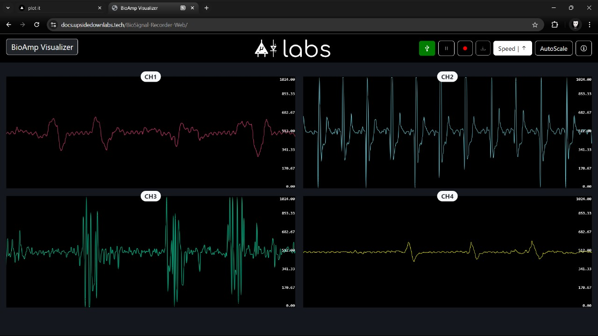
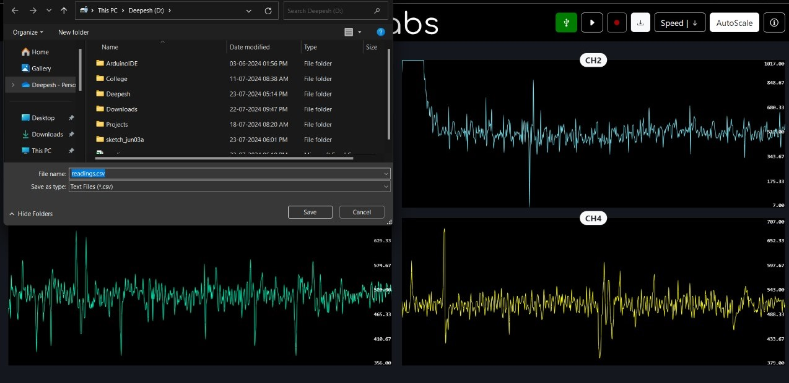
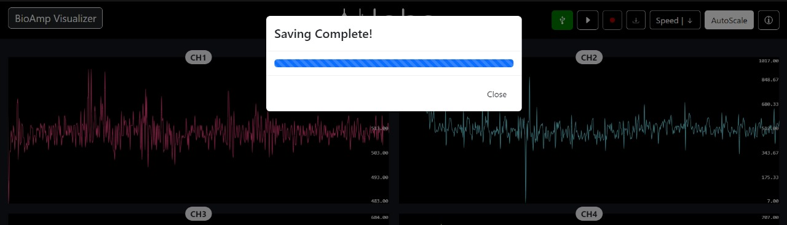

   <h1 align="center">BioAmp Visualizer</h1>

The <i>BioAmp Visualizer</i> is a web application designed for real-time signal visualization, particularly tailored for <i>bio-potential signals</i>. This tool serves as an advanced alternative to the standard Arduino serial plotter, offering enhanced functionality for researchers and enthusiasts working with BioAmp hardware. The application provides a user-friendly interface for displaying <i>time-series data streams</i>, with features including <i>adjustable graph speed</i>, and the <i>ability to pause, resume, and record data to CSV format</i>. By combining these capabilities, the BioAmp Visualizer aims to streamline the process of analyzing and interpreting bio-potential signals.

## Features

- **Signal Visualization:** Real-time display of Arduino four channel time series data using SmoothieCharts library.
- **Speed Adjustment:** Users can adjust speed of graph, speed can be toggled by provided speed button.
- **Data Management:** Signals data can be recorded and exported as CSV file.
- **Visualization Control:** Pause/Resume functionality for stream analysis.

## Prerequisites

- Chromium based web browser
- Access to an Arduino and Arduino IDE for flashing firmware.

## How to Use

1. Connect the Arduino to your computer using a USB cable.
2. Open the Arduino IDE and flash the provided firmware onto the Arduino.
3. Open the [BioAmp Visualizer](https://docs.upsidedownlabs.tech/BioSignal-Recorder-Web/) in a web browser.
4. Click the Connect button to establish a connection with the port on which Arduino is connected.
5. Click the Record button to start recording data into a CSV file.
6. To save the recorded data, click the Download button.

## Libraries Used

- [Bootstrap](https://getbootstrap.com/): CSS framework for styling the UI.
- [SmoothieCharts](http://smoothiecharts.org/): JavaScript library for real-time charting.
- [IndexedDB](https://developer.mozilla.org/en-US/docs/Web/API/IndexedDB_API): Browser-based database for storing recorded data.
