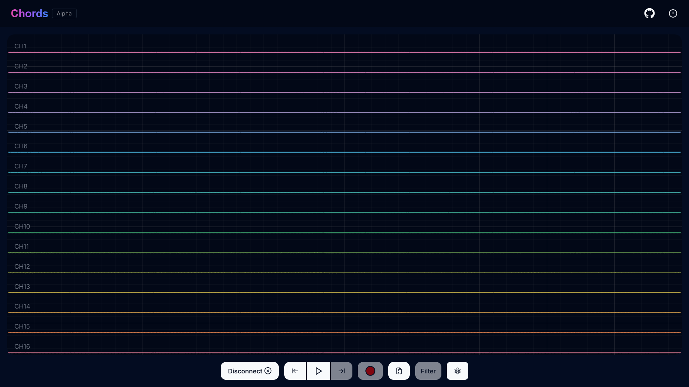

Chords is an application based on Web Serial connection, you can connect boards like Arduino Uno, Arduino Nano after uploading the ArduinoFirmware.ino code to it, you'll recieve data signals from the board which can be visualized on web using Chords. Users can visualize ECG and EMG signals.

> [!NOTE]
> Flash Arduino code to your hardware from [Chords Arduino Firmware](https://github.com/upsidedownlabs/Chords-Arduino-Firmware) to use it with Chords.

## Features

- **Connection**: Experience a smooth connection/disconnection with board in single click.
- **Real-time Visualization**: Visualize incoming data without any jitter from the board in real-time on SmoothieCharts.
- **Recording**: Record the signals data and download data in csv file.

## How to use

1.  Connect the Arduino to your computer using a USB cable.
2.  Open the Arduino IDE and flash the provided firmware onto the Arduino.
3.  Open Chords in a web browser.
4.  Click the "Connect" button to establish a connection with the Arduino and stream.
5.  Click the "Grid/List" button to chnage the view.
6.  Click the "Play/Pause" button to stop and start data on screen.
7.  Click "Autoscale" button to zoomin data visualization.
8.  Click the "Record" button to record data.
9.  To download the recorded data, click the "download" button.
10. Click the "Delete" button to delete recorded data.

## Technologies Used

- [Next js](https://nextjs.org/): A framework build on top of React.js.
- [TypeScript](https://www.typescriptlang.org/): Statically typed superset of JavaScript.
- [Tailwind CSS](https://tailwindcss.com/): Utility-first CSS framework.
- [Shadcn UI](https://tailwindcss.com/): Provides Reusable and customizable components, built with radix UI.
- [Smoothie Js](http://smoothiecharts.org/): Real time charting library.
- [IndexedDB](https://developer.mozilla.org/en-US/docs/Web/API/IndexedDB_API) Browser-based database for storing recorded data.

## Resources

- [Vendors](src/components/vendors.ts) list for board name and there vendor id are taken from [Stackblitz](https://stackblitz.com/edit/typescript-web-serial?file=vendors.ts) created by [William Grasel](https://github.com/willgm)

## Contributors

Thank you for contributing to our project! Your support is invaluable in creating & enhancing Chords-Web and making it even better. 😊

