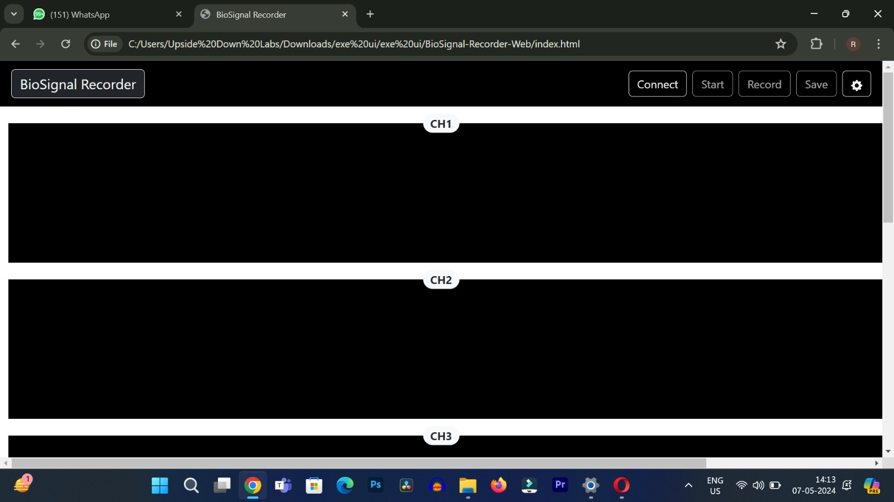
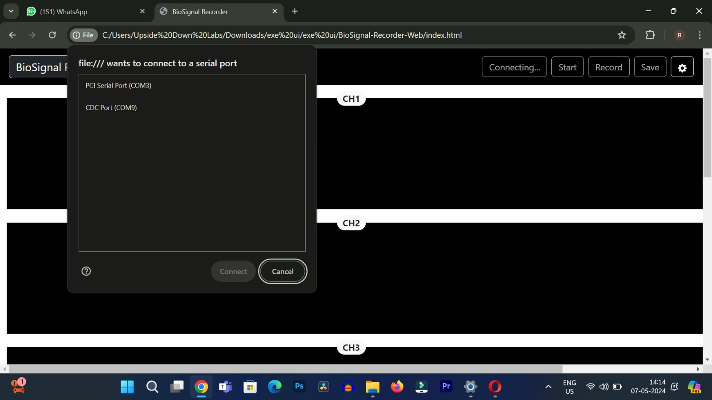
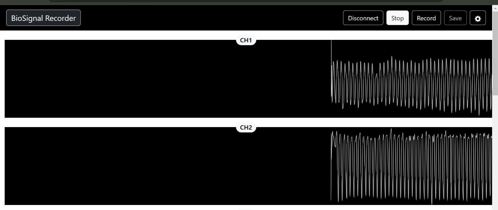
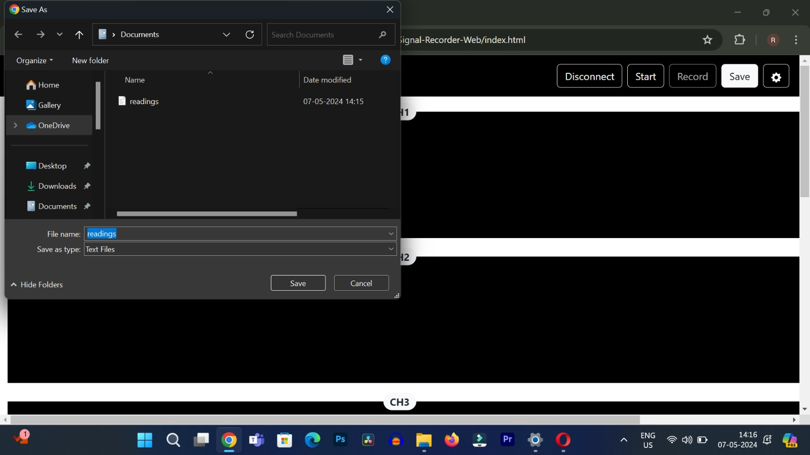
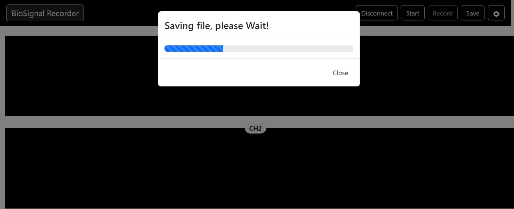

# BioSignal-Recorder-Web

Web Serial based BioSignal recorder applicaion.

This repository contains code for a BioSignal Recorder web application. The application allows users to connect to an Arduino, stream data from it, visualize the data in real-time using waveform charts, and record the data into a CSV file.

## Features

- **Real-time Visualization:** Visualize incoming data from the Arduino in real-time using SmoothieCharts.
- **Adjustable Settings:** Users can adjust settings such as the number of channels, waveform height, and streaming speed.
- **Connect and Disconnect:** Users can connect and disconnect from the Arduino easily.
- **Recording:** Users can record the incoming data into a CSV file.

## Prerequisites

- Google Chrome web browser
- Access to an Arduino and Arduino IDE for flashing firmware

## How to Use

1. Connect the Arduino to your computer using a USB cable.
2. Open the Arduino IDE and flash the provided firmware onto the Arduino.
3. Open the [BioSignal-Recorder-Web](https://docs.upsidedownlabs.tech/BioSignal-Recorder-Web/) in a web browser.
4. Adjust the settings as desired (number of channels, waveform height, etc.).
5. Click the "Connect" button to establish a connection with the Arduino.
6. Once connected, click the "Start" button to begin streaming data.
7. Click the "Record" button to start recording data into a CSV file.
8. To save the recorded data, click the "Save" button.

## Libraries Used

- [Bootstrap](https://getbootstrap.com/): CSS framework for styling the UI.
- [SmoothieCharts](http://smoothiecharts.org/): JavaScript library for real-time charting.
- [IndexedDB](https://developer.mozilla.org/en-US/docs/Web/API/IndexedDB_API): Browser-based database for storing recorded data.
